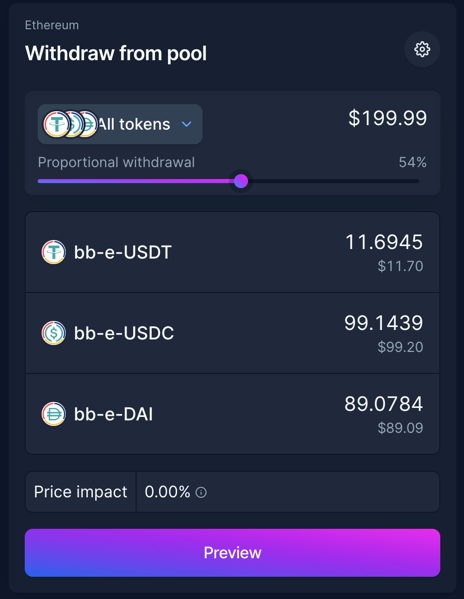
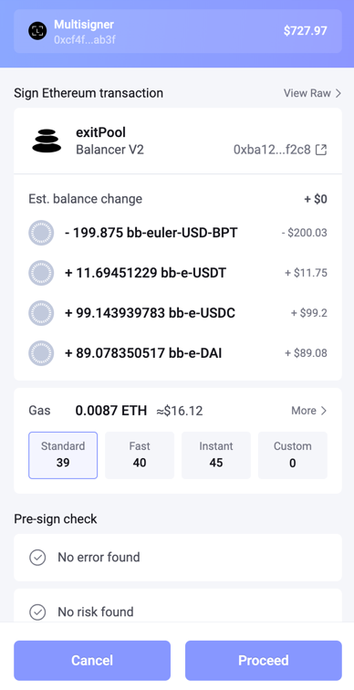
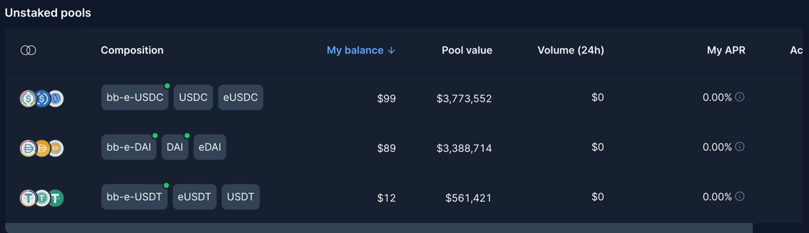
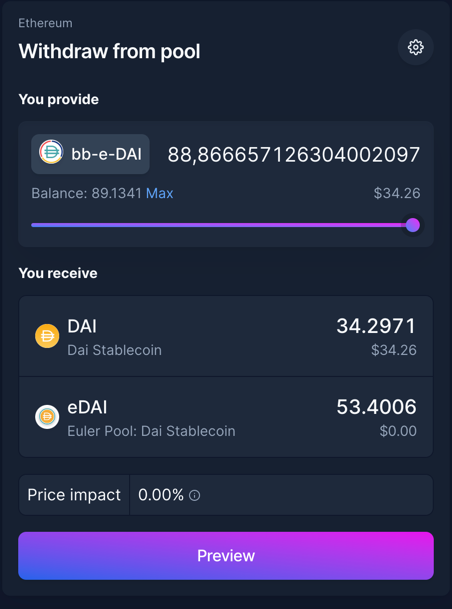
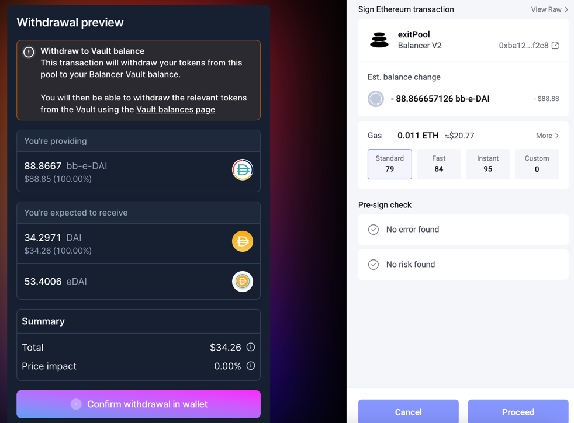
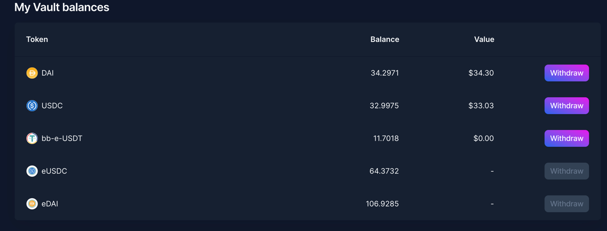
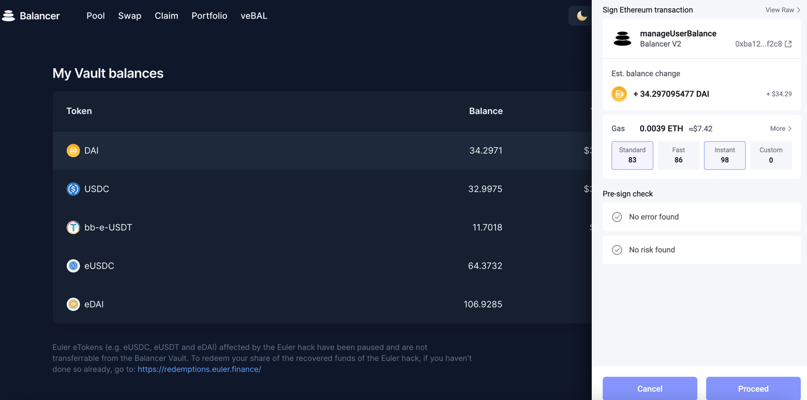

# Burning your bb-e-usd for using the UI
OpCo has finished their work on the UI changes to allow full withdraw from bb-e-usd.  Here are the steps to follow:

You should get arounnd 32 to 33 cents per bb--e-usd out.  The USDT burns to very little withdrawable tokens and is really in no case worth the gas.

### Following the TX
This guide was built using some bb-e-usd in Tritium's Multisginer Wallet.  Links and detailed screenshots for each transaction from the test are provided.  Tritium uses Rabby Wallet.  Note that I had already withdrawn the bb-e-usd for the etherscan warrior guide and then used some leftover tokens for the rest, so amounts don't match up well in the screenshots of the transactions.

## Prep Work
Withdraw all bb-e-usd composite tokens (paired with reth, wsteth, temple, dola) using the UI such that you have the most bb-e-usd you could ever have.

## Step 1: Emergency Exit bb-e-usd 

Go to the Pool page for [bb-e-usd](https://app.balancer.fi/#/ethereum/pool/0x50cf90b954958480b8df7958a9e965752f62712400000000000000000000046f)
Withdraw all your bb-e-usd proportionally:

---

---

https://etherscan.io/tx/0xe3803dae065a6ca1a33d7d8f98955de1fe98af2ae0a2168d75d5d12750dff8bf

## Step 2: Emergency Exit linear pool tokens to internal balances
Once the withdraw tx from bb-e-usd is executed, you should be able to go to the [portfolio view](https://app.balancer.fi/#/ethereum/portfolio) page and see the bb-e-usdc, bb-e-usdt, and bb-e-dai you have withdrawn:

It is not recommended to withdraw USDT due to low output, but you can.  For each of the tokens you wish to withdraw, follow this process(demonstrated for bb-e-dai but the same for the other coins.)

Click on the token in the pool to bring up the portfolio page [bb-e-dai](https://app.balancer.fi/#/ethereum/pool/0xeb486af868aeb3b6e53066abc9623b1041b42bc000000000000000000000046c).

Click Max and then Preview:

Read the notes up top that explains what will happen.  Then click withdraw and execute the tx:

https://etherscan.io/tx/0xd46789c0dd4556abf752a3e3bea2d77cd925e072fd2230f8f673a9f0bdde2ae9

Note that no balances are transferred to your wallet at this time, as the withdraw is done to internal balances in the vault as explained in the notice.

Once the transaction has executed, go to the new [Vault Balances Page](https://app.balancer.fi/#/ethereum/balances) that was linked in the notice on the withdraw screen.

Here you will see that your bb-e token has been broken up into DAI and eDAI (again ratios are off due to past actions).  You can withdraw any of the non-e-tokens by clicking withdraw.

https://etherscan.io/tx/0x3610540da27758957a70b81a3452292d6ccc3f4119338f29a2518587ccee0eb2

Repeat this process (step 2) for each bb-e component token you wish to redeem.

It may be easier to withdraw all the tokens to internal balances first and then withdraw everything from the vaults page, but perhaps more comforting to do one first and see that it works.  If you really want a low value test, start with USDT.

The eTokens will remain in your personal balance in the vault.  If at some point Euler unfreezes, you will be able to withdraw the eTokens using the internal balances tool.

## Step 3: Claim your redemption from Euler.

If you have not already done so, bb-e-usd HODLers also have tokens to claim directly from Euler.  They be claimed on the [Euler Redemption Page](https://redemptions.euler.finance/).

Thank you for your patience throughout this whole situation, and for providing liquidity on balancer.