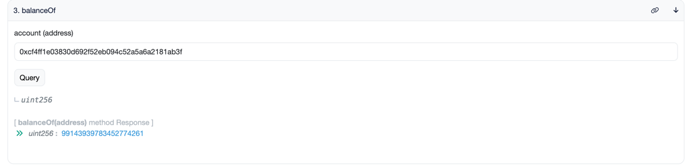
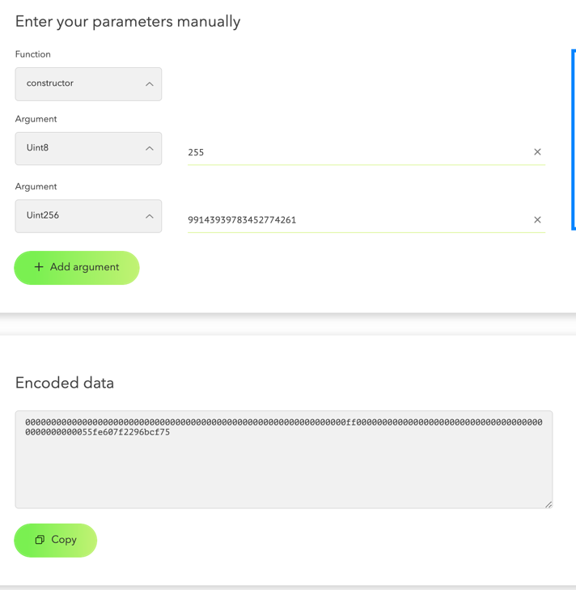
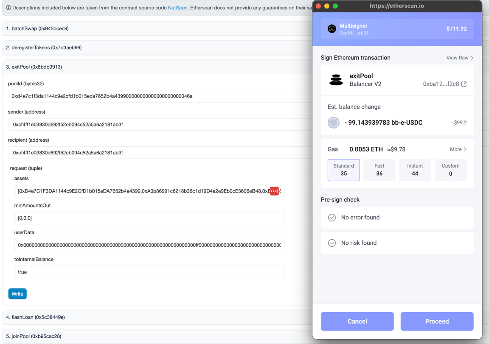
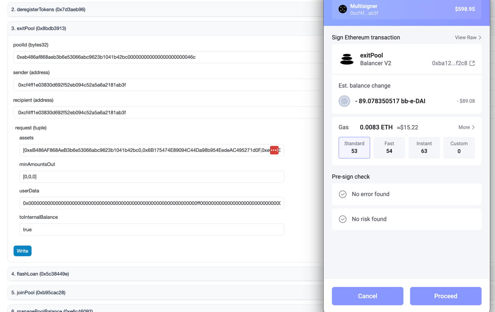

# Burning your bb-e-usd for the etherscan warrior
There's a lot of steps here, but you can do it.  Good luck.  The ability to do this all via the UI is comming soon.  If you get stuck you will be able to finish with the UI later.  Make VERY SURE to always enter your own address as the sender and receiver in the etherscan transactions and you're tokens will remain in your possesion.  No approvals are required.

### Following the TX
This guide was built using some bb-e-usd in Tritums Multisginer Wallet.  Links to each transaction from the test are provided.

## Step 1: Emergency Exit bb-e-usd 

Go to the Pool page for [bb-e-usd](https://app.balancer.fi/#/ethereum/pool/0x50cf90b954958480b8df7958a9e965752f62712400000000000000000000046f)
Withdraw all your bb-e-usd proportionally:

---

https://etherscan.io/tx/0xe3803dae065a6ca1a33d7d8f98955de1fe98af2ae0a2168d75d5d12750dff8bf

## Step 2: Emergency Exit linear pool tokens to internal balances

You just withdrew [bb-e-usdc](https://app.balancer.fi/#/ethereum/pool/0xd4e7c1f3da1144c9e2cfd1b015eda7652b4a439900000000000000000000046a), [bb-e-dai](https://app.balancer.fi/#/ethereum/pool/0x50cf90b954958480b8df7958a9e965752f62712400000000000000000000046f), and [bb-e-usdt](https://app.balancer.fi/#/ethereum/pool/0x3c640f0d3036ad85afa2d5a9e32be651657b874f00000000000000000000046b).
You can view your balances on those links, but you will not be able to withdraw because the e-tokens are not-transferrable causing the contract to revert.  In the next week or 2 the UI will be extended to allow you to withdraw to internal balances, breaking the LP while avoiding an ERC20 transfer of e-tokens.  For now you can do this in etherscan as follows:

### bb-e-usdc
Go to [bb-e-usdc](https://etherscan.io/address/0xd4e7c1f3da1144c9e2cfd1b015eda7652b4a4399#readContract) on etherscan.  

Run function 3. Balance of specifying your address.  Copy this number.

Go to https://abi.hashex.org/.  Select Function Constructor, and add 2 arguments:

| type    | value                    |
|---------|--------------------------|
| uint8   | 255                      |
| uint256 | balance from step above  |

Copy the encoded data or leave this window open:

Go to the [vault](https://etherscan.io/address/0xBA12222222228d8Ba445958a75a0704d566BF2C8#writeContract) on etherscan.

Run the function exitPool with the following settings:

| Field              | Setting                                                                                                                              |
|--------------------|--------------------------------------------------------------------------------------------------------------------------------------|
| poolId             | `0xd4e7c1f3da1144c9e2cfd1b015eda7652b4a439900000000000000000000046a`                                                                 |
 | sender             | your address                                                                                                                         | 
 | recipient          | your address                                                                                                                         |
 | assets             | `[0xD4e7C1F3DA1144c9E2CfD1b015eDA7652b4a4399,0xA0b86991c6218b36c1d19D4a2e9Eb0cE3606eB48,0xEb91861f8A4e1C12333F42DCE8fB0Ecdc28dA716]` |
 | minAmountsOut      | `[0,0,0]`                                                                                                                            |
 | userdata           | Copy the encoded data from the tool above.  You will need to stick 0x in front of the data.                                          |
 | toInternalBalance  | true                                                                                                                                 |

Sign and execute the transaction: https://etherscan.io/tx/0xc5f9c965c8f1b2130d6b995c4ecb119ff3804a8e6c28d62254c05d4b3e91e890

Note that you received no tokens.  You can now find and withdraw internal balances using a [Alpha Version of a tool created by Balancer Contributors](https://tools.balancer.blue/internalmanager)

#### bb-e-dai
Same deal.
- Get your balance [here](https://etherscan.io/token/0xeb486af868aeb3b6e53066abc9623b1041b42bc0#readContract)
- Generate a new userdata using the values using the encoder tool
- Then use the following values for exit pool (Different assets + userdata)

| Field              | Setting                                                                                                                              |
|--------------------|--------------------------------------------------------------------------------------------------------------------------------------|
| poolId             | `0xeb486af868aeb3b6e53066abc9623b1041b42bc000000000000000000000046c`                                                                 |
 | sender             | your address                                                                                                                         | 
 | recipient          | your address                                                                                                                         |
 | assets             | `[0xeB486AF868AeB3b6e53066abc9623b1041b42bc0,0x6B175474E89094C44Da98b954EedeAC495271d0F,0xe025E3ca2bE02316033184551D4d3Aa22024D9DC]` |
 | minAmountsOut      | `[0,0,0]`                                                                                                                            |
 | userdata           | Copy the encoded data from the tool above.  You will need to stick 0x in front of the data.                                          |
 | toInternalBalance  | true                                                                                                                                 
 ---

https://etherscan.io/tx/0xc56b23d901d9298ed27f104fbe5c14240a3028bf29afb5e81798ac03de17b73d

### bb-e-usdt
There's not enough to make it worth the gas.  If you want to waste money/play around, you can get the token list by querying getTokenList with the poolId of the bb-e-usdt pool on the vault.

### Step 3: Withdrawing your stablecoins
Go the [Alpha Version of the Internal Balancer tool created by Balancer Contributors](https://tools.balancer.blue/internalmanager)

Connect your wallet, you will be able to see and withdraw your internal balances there.

Note that as of the time of this writing the withdraw function was not working, so no tx's.

